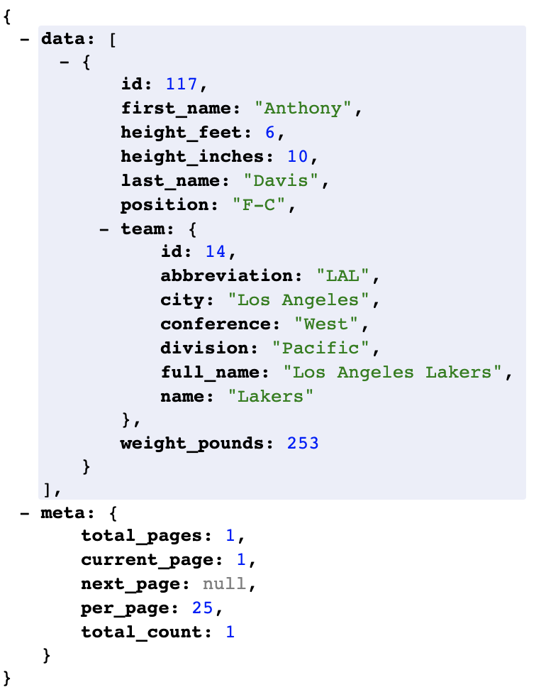
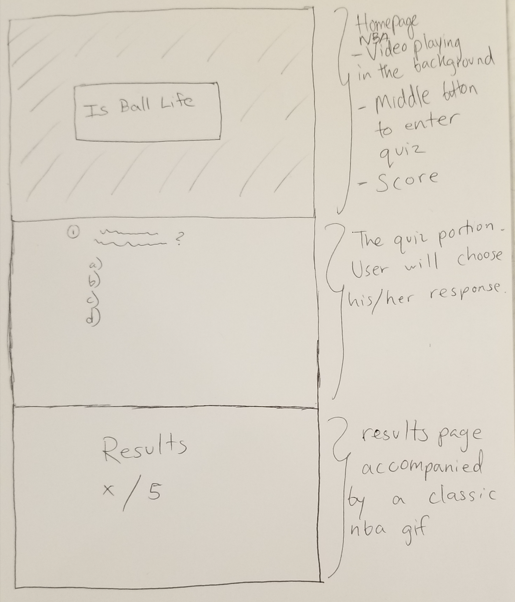

## Title: Is Ball Life?

## Description 

Essentially this will be a basketball trivia game. After clicking the initital title button, they will enter a page with five or so multiple choice questions. The user will go through this quiz and be given a score that determines if ball is life for him/her along with a winner or loser message.

## API
The API I will be using is the free Ball Don't Lie 

https://balldontlie.io/api/v1/players

The type of date this takes is player info from all over the NBA. Here's an example of Anthony Davis

Will use data from the NBA API to determine questions for quiz. 

## Wireframe

## Features

Light-hearted, multiple choice questions. Will need to return a score that measures their basktball acumen. When using the data from the API, I need to make sure the info is actually consistent. For example, if a question is what is Lebron's height, his actual height has to be the correct answer in the backend.

## Stretch Goals
Have an easy and a hard mode